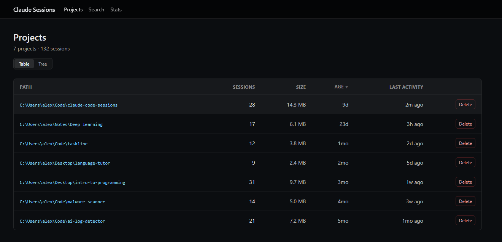
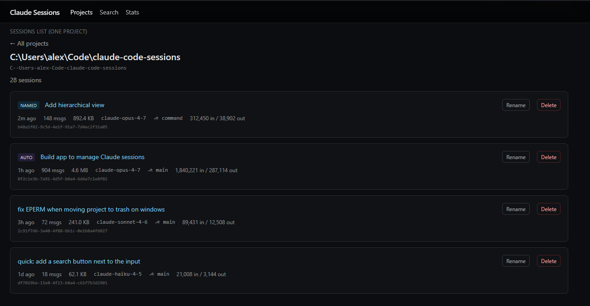
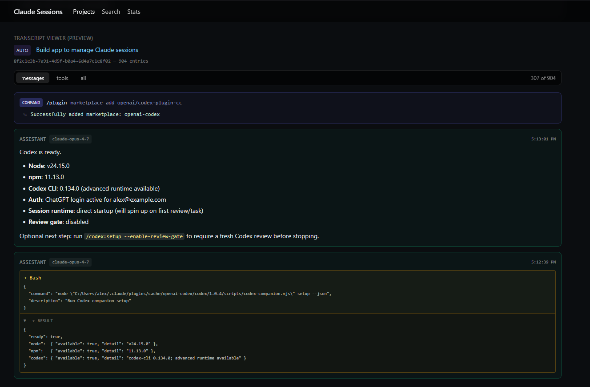

# claude-code-sessions

A local web app for browsing, searching, and managing the Claude Code session
logs that pile up under `~/.claude/projects/`. Everything runs on your
machine. No data leaves your computer; no Anthropic API calls are made.





---

## What it does

### Browse

- **Projects page (`/`)** — every folder under `~/.claude/projects/`, with the
  *real* directory path (resolved by reading the `cwd` field inside each
  session, not the lossy dash-encoded folder name). Two views, toggled with a
  pill at the top of the page:
  - **Table** — sortable columns: Path, Sessions, Size, Age, Last activity.
    Click any column header to sort; click again to flip direction.
  - **Tree** — projects nested under their parent directories. Single-child
    folder chains are collapsed visually (`C:\Users\post9\OneDrive` becomes
    one row instead of three). Folders show aggregated session count, size,
    and most recent activity.
  - Your view choice is remembered in `localStorage`.
- **Sessions page (`/p/[projectId]`)** — every session in one project. Each
  row shows the title (alias → ai-title → first user prompt), message count,
  model used, git branch, total input/output tokens, file size, and the
  session UUID.
- **Transcript viewer (`/p/[projectId]/s/[sessionId]`)** — renders the JSONL
  as readable messages.
  - Markdown formatting (bold, italic, lists, fenced code blocks, inline
    code, links).
  - Slash commands (`/clear`, `/model`, etc.) and their stdout are merged
    into a single compact block, terminal-style.
  - Tool calls are merged with their matching tool results in one card. Long
    results are collapsed by default with a `▶` toggle and a one-line preview.
  - "Thinking" blocks are collapsible.
  - Filter pills: **messages** (default — hides meta/tool-result chatter),
    **tools** (only entries that involve a tool call), **all** (raw).
  - Sticky page header + sticky filter bar so navigation stays accessible in
    long sessions.
  - Floating ↑/↓ buttons to jump to top/bottom.

### Search (`/search`)

Case-insensitive substring scan across every line of every `.jsonl` in
`~/.claude/projects/`. Matches anywhere: user prompts, assistant replies,
tool names, file paths, error messages, session UUIDs, git branches. Each
result links to the matching session.

### Stats (`/stats`)

Five summary tiles: projects, sessions, total disk size, total input tokens,
total output tokens — aggregated across every session log on disk.

### Manage

- **Rename a session** — give any session a custom display name.
  - Stored in `~/.claude/projects/_aliases.json` (a sidecar file the app
    owns; Claude Code ignores it).
  - **Also mirrored into the `.jsonl`** as a new `ai-title` line, so
    Claude Code's terminal `/resume` picker shows the same name. The
    `<uuid>.jsonl` filename and the session UUID are never changed —
    Claude Code's internal references stay intact.
  - Click **Rename** next to any session title to edit inline. Empty name
    removes the alias and lets the title fall back to the auto-generated
    one.
- **Delete a session or whole project** — confirmation prompt first, then
  `fs.rm` with retries (handles transient Windows file locks from AV /
  OneDrive sync).

---

## Setup

### 1. Prerequisites

- **Node.js 20+**. Check with `node -v`.
- An existing `~/.claude/projects/` directory (it appears the first time you
  run Claude Code).

### 2. Get the code

```powershell
git clone https://github.com/POSTTTT/claude-code-sessions
cd claude-code-sessions
```

### 3. Install dependencies

```powershell
npm install
```

> **OneDrive caveat (Windows).** If you cloned this repo into a OneDrive-synced
> path like `C:\Users\<you>\OneDrive\Documents\GitHub\…`, `npm install` may
> hang silently — OneDrive's file-on-demand sync intercepts every small write
> npm makes. If you see no progress after a couple of minutes:
>
> 1. Right-click the OneDrive tray icon → **Pause syncing → 2 hours**, then
>    retry `npm install`, **or**
> 2. Move the repo to a non-synced path (e.g. `C:\dev\claude-code-sessions`)
>    and install there.

### 4. Register the launcher (one time)

```powershell
npm link
```

This installs a global command called `claude-sessions` that points at this
project's copy. You only need to do this once per machine. (Equivalent
alternative: `npm install -g .` from the project folder.)

### 5. Launch from anywhere

```powershell
claude-sessions
```

That's it — no `cd`, no `npm run`. Open the URL the server prints (defaults
to <http://localhost:3000>).

Flags:

The browser opens automatically as soon as the server is ready. Pass
`--no-open` to skip that.

| Command                     | What it does                                            |
| --------------------------- | ------------------------------------------------------- |
| `claude-sessions`           | Start the **dev** server + auto-open browser (default)  |
| `claude-sessions --prod`    | Start the **production** server (requires a prior build) |
| `claude-sessions --build`   | Run `next build`, then start the production server      |
| `claude-sessions --no-open` | Don't open the browser                                  |
| `claude-sessions --help`    | Show the help and the project path                      |

To stop the server: `Ctrl+C` in the terminal where it's running.

### 6. Pointing at a different `.claude` directory (optional)

By default the app reads from `<homedir>\.claude\projects\`. To point at a
different location, set the `CLAUDE_HOME` environment variable before
starting the server:

```powershell
$env:CLAUDE_HOME = "D:\backups\.claude"
claude-sessions
```

---

## Project layout

```
bin/
  claude-sessions.mjs               global launcher (npm bin)
src/
  app/
    page.tsx                          projects list
    p/[projectId]/page.tsx            sessions in a project
    p/[projectId]/s/[sessionId]/      session transcript
    search/page.tsx                   content search
    stats/page.tsx                    summary tiles
    actions.ts                        server actions (delete, rename)
    layout.tsx, globals.css           sticky header + dark theme
  components/
    ProjectsView.tsx                  table/tree toggle (client)
    ProjectsTable.tsx                 sortable table (client)
    ProjectsTree.tsx                  directory tree (client)
    SessionTitle.tsx                  inline rename (client)
    DeleteButton.tsx                  delete w/ confirm (client)
    TranscriptView.tsx                transcript renderer + filters
    Markdown.tsx                      lightweight markdown renderer
  lib/
    paths.ts                          CLAUDE_HOME / PROJECTS_DIR + decode
    sessions.ts                       list/read/search/delete + stats
    aliases.ts                        rename sidecar + ai-title mirror
    format.ts                         bytes / relative / duration / number
```

## Stack

- Next.js 15 (App Router) + React 19
- TypeScript, Tailwind CSS
- Server-side filesystem access via Server Actions and one Route Handler
- No database, no auth — runs locally on `localhost` only

## Safety

- **Delete is permanent.** The app uses `fs.rm` to remove the `.jsonl` file
  (or the whole project folder). A confirmation dialog shows the full path
  before anything is removed.
- **Rename never touches the `.jsonl` content** — only appends a single
  `ai-title` line. Existing entries are preserved.
- **The app is single-user, no auth.** It expects to be reached on
  `localhost` only. Don't expose it on a network.

## License

See `LICENSE`.
